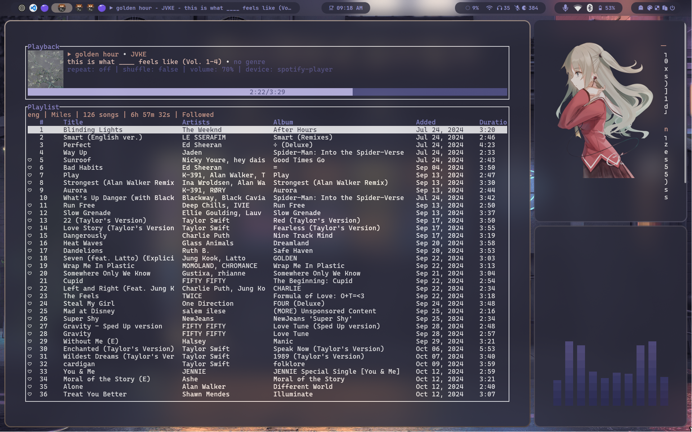
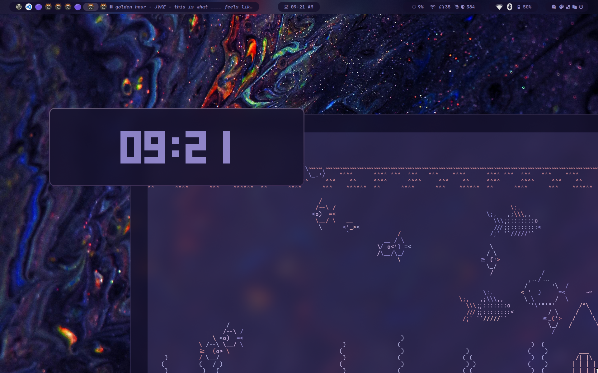
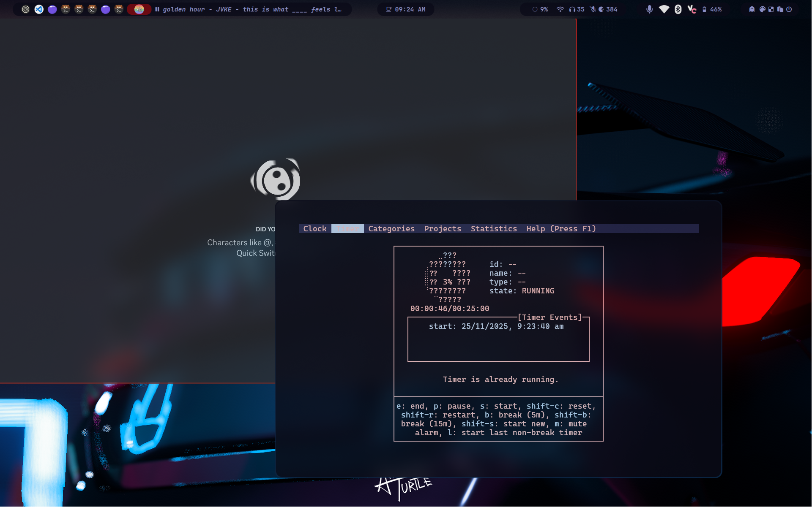

# HyprFLX

A modern, fast and aesthetic Hyprland rice based on 
PrasanthRangan's dotfiles — heavily customized, optimized, and themed.

## -> Features
- Clean and modern Waybar design
- Beautiful animations + blur
- Spotify TUI integration (SPT)
- Vesktop support
- Multiple themes + wallpapers
- Custom popups for brightness/audio
- Dev-ready (Node, React, Tailwind friendly)
- Tweaked keybindings for fast workflow

## -> Screenshots

<p align="center">
  
  
</p>

<p align="center">
  
</p>


## -> Requires
- Hyprland
- Waybar
- Rofi (Wayland)
- Swww
- SPT (Spotify TUI)
- Vesktop
- Kitty
- Playerctl
- Brightnessctl

## -> Install
```bash
git clone https://github.com/miles-spidee/HyprFLX
cd HyprFLX
chmod +x install.sh
./install.sh
```

